# TankWar

坦克大战(TankWar)游戏是1990经典版的坦克大战的复刻，使用PyGame框架、结合面向对象程序设计的方法来重构，不仅游戏的玩法功能完成了全部的作业要求，它还具有一定的可扩展性。额外支持了双人模式和一些更多的场景元素，支持为每个类型的坦克设定最大子弹上限和子弹飞行速度。

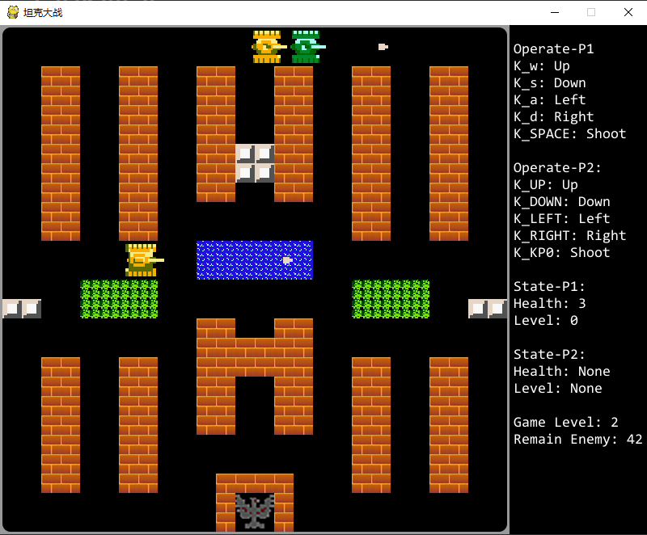

## Features

* 双人模式
* 动画与音效
* 特殊的场景元素：草丛、河面和可以通行的冰面
* 各种各样的道具

## Rules

玩家一WASD控制方向、空格键开火，玩家二上下左右控制方向、小键盘数字0键开火。

每个玩家初始时拥有3个生命值，初始时坦克等级为0，吃到道具可以提升坦克等级，被子弹打中若坦克等级为0则坦克爆炸（减少生命），否则降低坦克等级，没有生命值时坦克将不能重生（即为死亡），所有玩家坦克都死亡则游戏结束。

击败所有当前关卡的敌方坦克进入下一关，关卡无限制，随机挑选关卡进行游戏（必定与上一局游戏关卡不同）。

子弹可以打破红砖块，升级的坦克发出的子弹可以打破铁砖，坦克可以隐藏进入草丛，可以在冰面上滑行但不能通过河面。

道具可以增加我方坦克生命、令敌人静止不动、使我方坦克升级、破坏所有场上的地方坦克等，我方子弹击中越高等级的敌人越有概率生成道具（每个敌人出生时有概率携带一个道具掉落，等级越高越可能有道具掉落）。

每个坦克每隔一定间隔只能发出一个子弹，子弹必须在撞到其他实体、场景元素或者边界而消失时才能发出下一发，越高等级的坦克子弹飞行速度越快。

电脑方的坦克有三种类型，1）快速坦克：行驶速度比玩家的坦克快，但自身防御力低，可被玩家坦克一炮击毁；2）重型坦克：行驶速度慢，装甲厚，需要三发炮弹才能击毁；3）普通坦克：行驶速度和防御能力介于以上两者之间，需要二发炮弹才能击毁。

第一个关卡的电脑方坦克数量为20，关卡中最大敌方坦克数量限制为6，每过一关，电脑方坦克数量增加1辆，最大敌方坦克数量限制也增加1，重装坦克的随机生成权重提高

## Design

先从框架讲起，游戏基于PyGame框架实现，PyGame框架为开发游戏提供了一套完善的解决方案，`pygame.Sprite.Sprite`可以视为游戏里的某个元素，`pygame.Sprite.Group`可以看做是元素的聚集，有了这个基础，就可以在此之上进行碰撞检测等等操作

PyGame框架的游戏核心是基于事件循环，用户也可以自定义事件并在主循环中对事件作出响应，在主循环中可以控制游戏的帧率，使得动画在不同的机器上显示出相同的效果。

在Python中，一个Protected方法的声明方式是在其前面加一个`_`，而Private方法的声明是加两个`_`，对于Getter和Setter方法则是使用装饰器`@property / @var.setter`来实现。

### TankGame

游戏实例类`TankGame`为单例模式，其内部存储着游戏的关键状态信息（例如当前关卡`level`、是否退出游戏`quit_game_flag`、多人模式选项`multiplayer_mode`、游戏窗体实例`__screen`）与界面管理类`ViewManager`进行直接交互，根据当前的状态判断展示哪个界面并在游戏结束时做出最外层的响应。

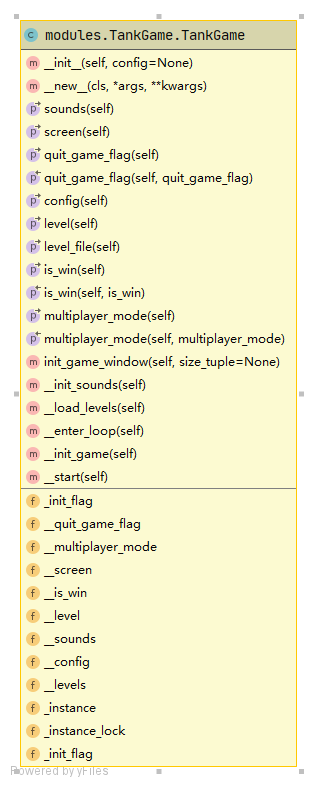

`_init_flag`表示游戏加载完成状态，表示目前是否应该退出游戏，`__config`为游戏配置文件，`__levels`为游戏关卡列表，


### ViewManager

界面管理类负责管理游戏加载`SwitchLevelView`、游戏开始`GameStartView`、游戏结束`GameOverView`、游戏关卡`GameOverView`四个实现了`AbstractView`抽象接口的具体游戏界面类的加载工作。

界面在实例化时自动预加载，只有在调用其`show()`方法时才显示，预加载是将不需要重复加载或初始化的资源提前加载进入内存，在需要显示界面的时候直接显示以提高其效率。

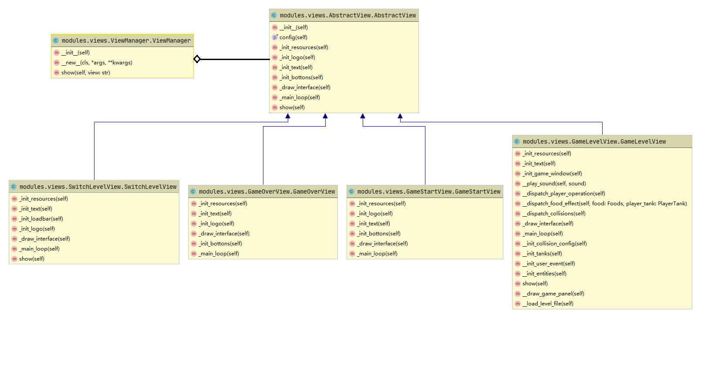

每个界面重载加载资源`_init_resources()`、加载静态文本`init_text()`、加载图标`init_logo()`的方法以定义其预加载的行为，重载`_draw_interfaces()`定义其每次进行绘制时的行为，重载`_main_loop()`则实现其主要功能。

## GameLevel

游戏关卡类`GameLevelView`是坦克大战的核心，携带有每次关卡相关的所有状态，并再每次调用`show()`方法时加载关卡文件和初始化状态。对于各种事件的处理和渲染工作，是在一个事件循环`EventLoop`中完成的（重载了`_main_loop()`方法），按顺序分别是：

1. 退出游戏事件捕捉
2. 敌方坦克生成
3. 处理用户按键
4. 碰撞检测（实体与场景、实体与实体）
5. 更新并绘制实体`self.__entities.update`——处理实体的移动、道具的生成、实体的湮灭
6. 游戏界面（包含状态面板）`_draw_interface()`
7. 坦克存亡判断

注：敌方坦克AI是在绘制了所有其他的实体后进行的

```python
def _draw_interface(self):
    screen = TankGame().screen
    screen.fill((0, 0, 0))
    screen.blit(self.__background_img, (0, 0))
    self.__scene_elements.draw(screen, 1)
    self.__entities.draw(screen, 1)
    self.__scene_elements.draw(screen, 2)
    self.__home.draw(screen)
    self.__entities.draw(screen, 2)
    self.__draw_game_panel()
    pygame.display.flip()

def _main_loop(self):
    clock = pygame.time.Clock()
    while self.__has_next_loop:
        # 游戏退出事件捕捉
        for event in pygame.event.get():
            if event.type == pygame.QUIT:
                pygame.quit()
                sys.exit()
            # 敌方坦克生成
            elif event.type == self.__generate_enemies_event:
                ......
        # 用户按键处理
        self.__dispatch_player_operation()
        # 碰撞检测
        self.__dispatch_collisions()
        # 更新并绘制实体
        self.__entities.update(self.__scene_elements, self.__home)
        # 绘制界面
        self._draw_interface()
        # 我方坦克都挂了
        if len(self.__entities.player_tanks) == 0:
            self.__is_win_flag = False
            self.__has_next_loop = False
        # 敌方坦克都挂了
        if self.__total_enemy_num <= 0:
            self.__is_win_flag = True
            self.__has_next_loop = False

        clock.tick(60)
```

### Things on a Level

坦克大战的关卡中将游戏中的所有“东西”分为了两个大类，分别是实体（子弹、坦克、道具）和场景元素（家、砖块、铁块、河流、草丛），而道具是拥有场景元素特性的实体，它虽然继承`SceneElement`，但属于实体，合成于`EntityGroup`

`SceneElementGroup`使用了类似于合成模式的设计，合成了所有场景元素的聚集，提供统一的`add()`/`draw()`方法控制添加进哪个具体`pygame.sprite.Group`和绘制每类场景元素的聚集，而场景元素的创建需经`SceneFactory`工厂进行创建

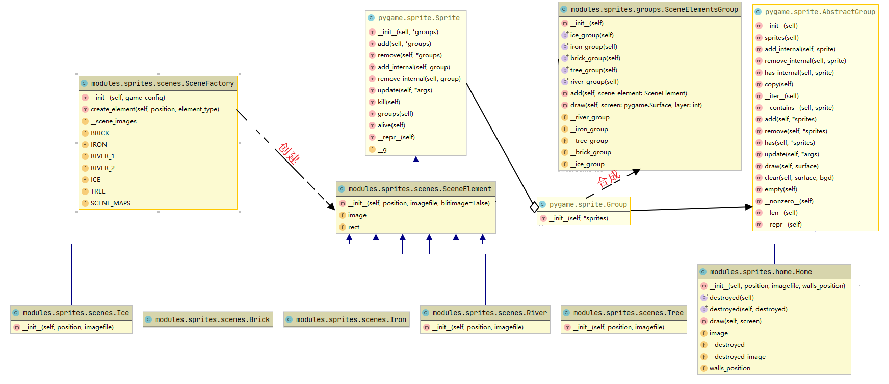

`EntityGroup`使用了类似于适配器模式的设计，与`SceneElementGroup`的功能类似，但若是创建坦克，则要经过`TankFactory`进行创建。提供统一的`add()`/`draw()`/`remove()`/`update()`方法控制实体聚集的创建/绘制/删除/更新、

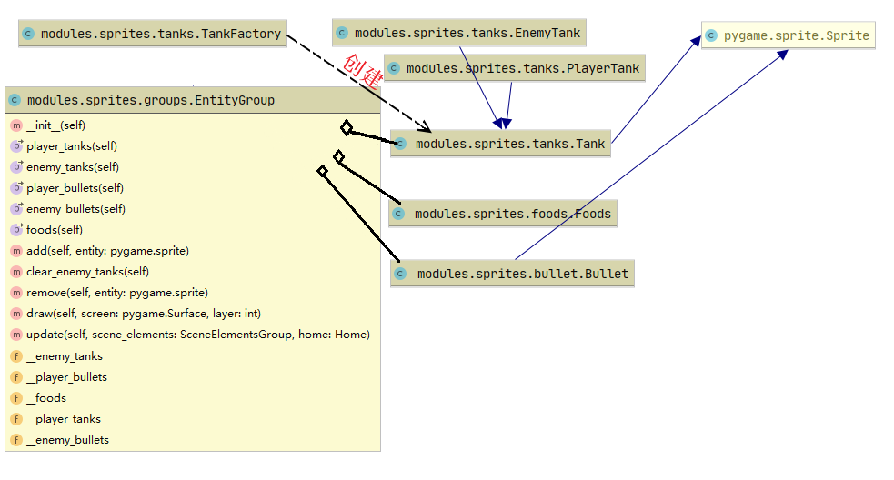

### Tanks

坦克工厂类负责坦克的创建，`Tank`是坦克的抽象类，定义了：

* 通用接口射击`shoot()`、滚动轮子特效`roll()`、移动`move()`、降级`decrease_level()`、更新状态`update()`

  `shoot()`进行射击时判断当前是否处于射击冷却，子弹数量是否满足要求，若射击有效则返回一个`Bullet`

  `move()`则与包含家在内的场景元素进行和其他坦克碰撞处理，判断是否移动出游戏边界，从而断定能否进行移动

  `update()`则根据游戏的状态更新坦克的状态

* 子弹相关的通用的属性和方法：子弹配置`_bullet_config`、初始子弹数量`bullet_limit`、是否允许无限子弹`infitity_bullet`、是否处于发射冷却`_is_bullet_cooling()`

* 坦克的基本状态：是否已经爆炸`_booming_flag`、`bullet_count`当前子弹数量、`speed`移动速度

* 坦克的资源图像属性：`image`使用装饰器重载的显示当前坦克图像的Getter（需要根据当前是否爆炸、移动方向来返回坦克的图像）、`_level_images`不同坦克等级对应的图片等等。

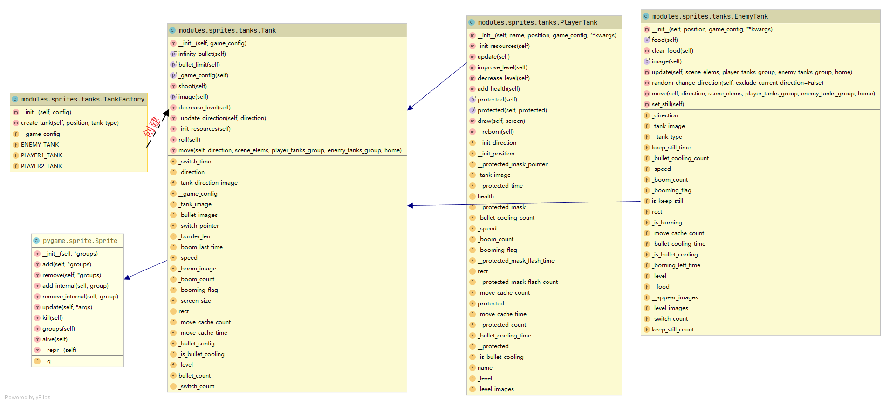

玩家坦克类`PlayerTank`拥有特有的`health`生命值属性、`protected`无敌状态属性、`__reborn()`重生方法以及标识是哪个玩家的字段`name`

而敌人坦克类`EnemyTank`拥有特有的`food`携带的道具的属性、`set_still()`设定静止不动方法、`random_change_direction()`随机并自动找到可以走的下一个方向的方法

### Bullet

为了实现每个坦克只能发射一定数量在屏幕中飞行的子弹这个需求，则为每个子弹附上一个`tank`字段，标识子弹的所属坦克，并重载`kill()`方法，在子弹湮灭时令`tank.bullet_count+1`，`enchanced`为子弹是否可以打破铁砖，`move()`处理子弹飞行，并检测是否飞出边界

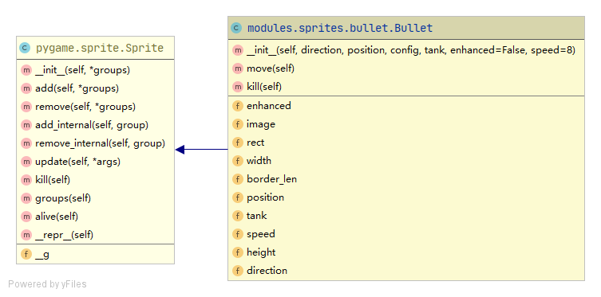

子弹与实体/场景元素的碰撞检测位于游戏关卡界面类中的`__dispatch_collisions()`，分别处理子弹与砖块/铁砖的碰撞、子弹与家的碰撞、敌人子弹与玩家坦克的碰撞、玩家子弹与敌人坦克的碰撞。

```python
def __dispatch_collisions(self):
	collision_results = {
		'group': {},
		'sprite': {},
		'foreach_sprite': {},
	}
	for (collision, args) in self.__collisions['group'].items():
		collision_results['group'][collision] = groupcollide(*args)

	for (collision, args) in self.__collisions['sprite'].items():
		collision_results['sprite'][collision] = spritecollide(*args)

	for (collision, args) in self.__collisions['foreach_sprite'].items():
		arg_list = list(args)
		sprite_list = arg_list[0]
		for sprite in sprite_list:
			arg_list[0] = sprite
			args = tuple(arg_list)
			collision_results['foreach_sprite'][sprite] = spritecollide(*args)

	for bullet in self.__entities.player_bullets:
		collision_result = spritecollide(bullet, self.__scene_elements.iron_group, bullet.enhanced, None)
		if collision_result:
			bullet.kill()

	...
    
	# --我方子弹撞敌方坦克
	for tank in self.__entities.enemy_tanks:
		if collision_results['foreach_sprite'][tank]:
			if tank.food:
				self.__entities.add(tank.food)
				tank.clear_food()
			if tank.decrease_level():
				self.__play_sound('bang')
				self.__total_enemy_num -= 1

	# --敌方子弹撞我方坦克
	for tank in self.__entities.player_tanks:
		if collision_results['foreach_sprite'][tank]:
			if tank.protected:
				self.__play_sound('blast')
			else:
				if tank.decrease_level():
					self.__play_sound('bang')
				if tank.health < 0:
					self.__entities.remove(tank)

	if collision_results['sprite']['PlayerBulletWithHome'] or collision_results['sprite']['EnemyBulletWithHome']:
		self.__is_win_flag = False
		self.__has_next_loop = False
		self.__play_sound('bang')
		self.__home.destroyed = True

	if collision_results['group']['PlayerTankWithTree']:
		self.__play_sound('hit')
```

### Foods

游戏中的道具则是`Foods`，大写的静态常量`BOOM`、`IRON`则是道具的标识符，`exist_time`为存在时间，`update()`处理存在时间的倒计时和在一定时间后从游戏中移除这个道具。

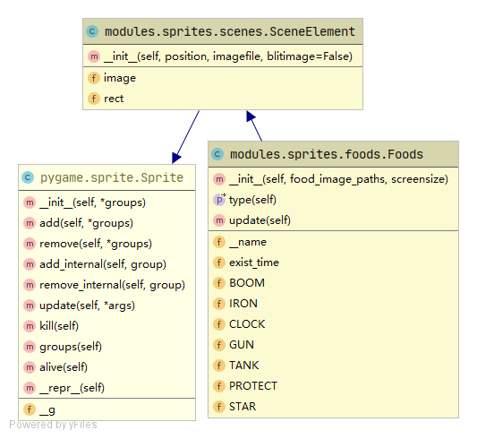

道具的处理位于游戏关卡界面类中`__dispatch_food_effects()`，负责播放音效和产生对应的效果并从实体组中移除这个道具实例，当玩家坦克与Foods实体发生碰撞时将会触发，而碰撞的处理也是在游戏关卡界面类中的`__dispatch_collisions()`进行的

```python
def __dispatch_food_effect(self, food: Foods, player_tank: PlayerTank):
    self.__play_sound('add')

    if food.type == Foods.BOOM:
        for _ in self.__entities.enemy_tanks:
            self.__play_sound('bang')
        self.__total_enemy_num -= len(self.__entities.enemy_tanks)
        self.__entities.clear_enemy_tanks()
    elif food.type == Foods.CLOCK:
        for enemy_tank in self.__entities.enemy_tanks:
            enemy_tank.set_still()
    elif food.type == Foods.GUN:
        player_tank.improve_level()
    elif food.type == Foods.IRON:
        for x, y in self.__home.walls_position:
            self.__scene_elements.add(
                self.__scene_factory.create_element((x, y), SceneFactory.IRON)
            )
    elif food.type == Foods.PROTECT:
        player_tank.protected = True
    elif food.type == Foods.STAR:
        player_tank.improve_level()
        player_tank.improve_level()
    elif food.type == Foods.TANK:
        player_tank.add_health()

    self.__entities.foods.remove(food)

def __dispatch_collisions(self):
    ...
	for player_tank in self.__entities.player_tanks:
		for food in self.__entities.foods:
			collision_result = collide_rect(player_tank, food)
			if collision_result:
				self.__dispatch_food_effect(food, player_tank)
    ...
```

## UMLs

### Statechart diagram

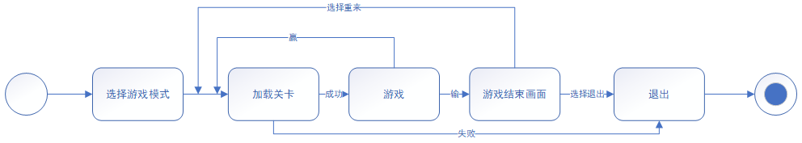

### Use case diagram


### Class diagram

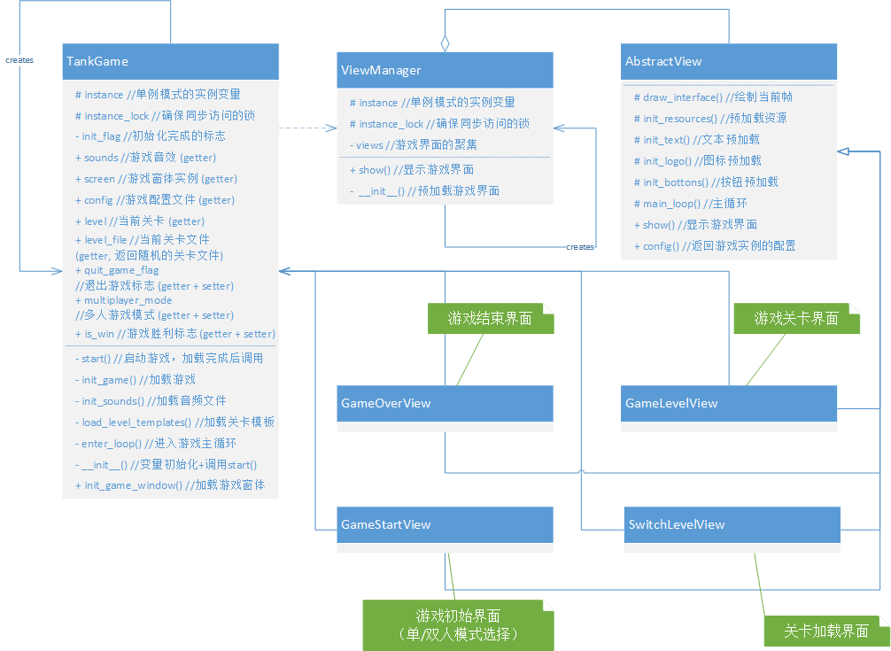

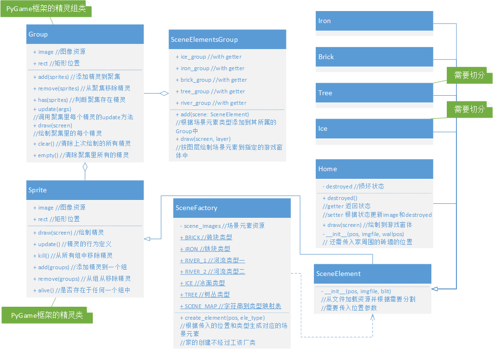

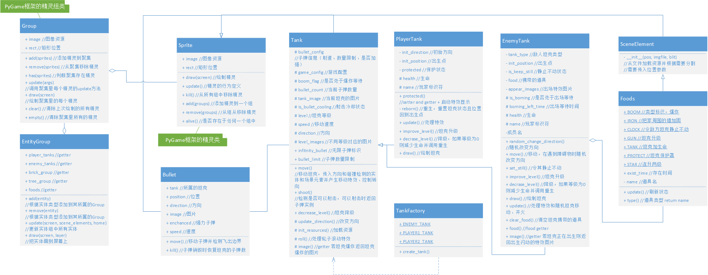

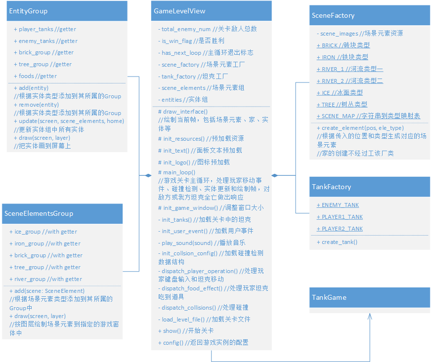

## Improvements

基于原有的坦克大战的设计改进如下：

1. 在原有的项目中，经常有需要传入各式各样的游戏资源路径参数的构造函数，对TankGame进行单例模式设计的改进，可以令TankGame存储一个`config`保存所有游戏资源的路径数据，这样在有其他类需要访问游戏资源路径参数的时候，就可以通过`TankGame().getConfig`进行访问。类似的，`TankGame`也拥有一个`Screen`对象，为当前游戏窗口的唯一引用，这样就不用每个画面类都存一个`Screen`对象。
2. 在原有的项目中，关卡加载、游戏开始、游戏结束的画面类都放在了`interfaces`这个包中，但是`GameLevel`同样作为一个画面，却放在了这个包的外头，而且画面类有固定的行为模式但没有继承关系、没有抽象，且加载资源的时候由于画面之间相互切换，导致一个界面加载了很多次，并且界面创建时需要向构造函数传入各种的游戏配置参数，十分麻烦。对此，进行的改进是：对画面进行抽象，抽象出一个`AbstractView`定义画面的通用行为模式，用一个`ViewManager`单例管理所有的画面的预加载和显示，提升了程序的工作效率
3. 在原有的项目中，玩家坦克和敌方坦克同样是具有一些相同的行为模式（比如移动`move()`、射击`shoot()`、升降级和死亡），但却没有一个抽象，而且每次对象初始化都要分别传入一堆的资源文件路径，不仅不方便、而且所以改进是`Tank`就是对敌方坦克和玩家坦克的一个抽象，在创建坦克对象时由`Tankfactory`负责，`TankFactory`提前装载好`Config`，然后在坦克创建的时候只需指定坦克的位置和类型即可完成创建
4. 在原有的项目中，没有区分场景元素`SceneElement`和实体`Entity`，当然也没有场景元素组`SceneElementsGroup`和实体组`EntityGroup`，每次访问都是对具体的游戏元素组的直接访问，一个类型的游戏元素只能放进只属于自己类型的组，这里就可以将游戏的元素区分为场景元素和实体，所有的场景元素继承抽象的场景元素类，场景元素的创建由场景元素工厂`SceneElementFactory`负责。场景元素组存储所有各类场景元素的聚集，根据传入的场景元素的类型自动判别要操作的聚集目标。实体的分类是基于概念的，但是实体组是根据实体的概念分类管理实体，根据传入的实体的类型自动判别要操作的聚集目标。
5. 在原有的项目中，所有的游戏各个模块的处理都囊括在了主循环当中，显然这是不易于维护的，所以就把各个处理重新分配到了游戏关卡类的各个函数当中，每个函数都有对应一个职责（游戏逻辑、碰撞处理、文字渲染、画面渲染、用户事件接受、游戏终止判断），使得游戏关卡类的过程内聚。

## Postscript

在学习过了面向对象设计分析课程之后也了解了不少设计模式，虽然说拥有解决复杂工程项目的能力，但是目前依然欠缺一些应用能力，不能很好地利用所学的知识来组织复杂工程项目，项目依然存在可改进之处。

从第一次commit到最后一次commit，历时一个多月的时间（真正开发的时间有100h+），将一个Github完全看上去组织地较乱的游戏工程项目改造成了一个具有面向对象设计思想的游戏，还是第一次尝试重构这样的项目。

重构的过程需要不断地进行抽象、重新设计、并进行测试，需要检测游戏功能逻辑和原有项目之间是否一致，重构时出现bug是非常常见的事情，利用好测试以及版本差异比较工具解决重构产生的逻辑不一致也很重要，测试理想情况下是利用自动化单元测试，但是能力有限只进行了手动测试。

参考项目：https://github.com/CharlesPikachu/Games/tree/master/Game5

## Screenshots

### Choose Multi-Player

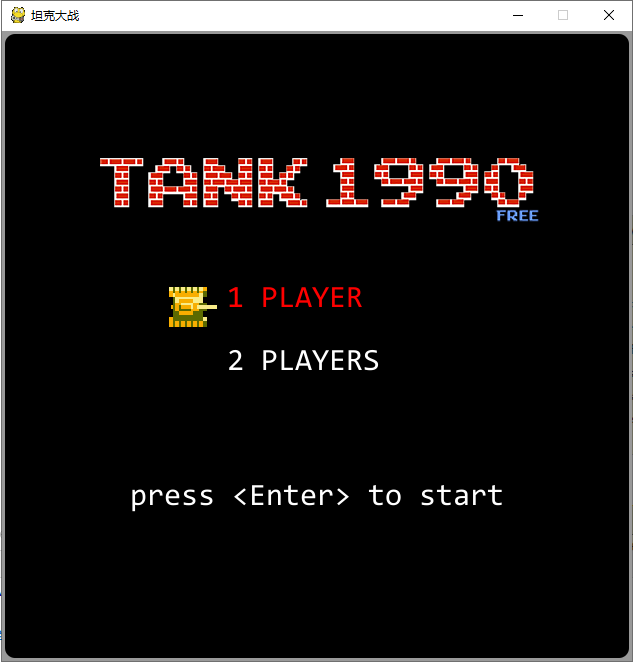

### Loading a Level

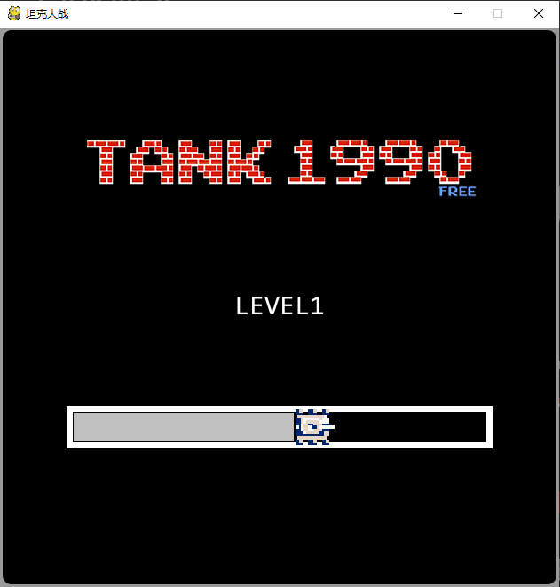

### Playing in a Level

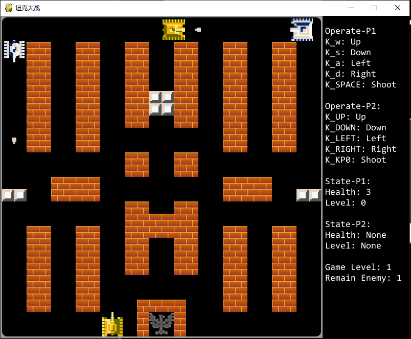

### Game Over

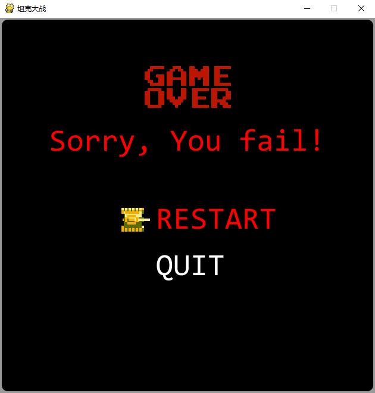